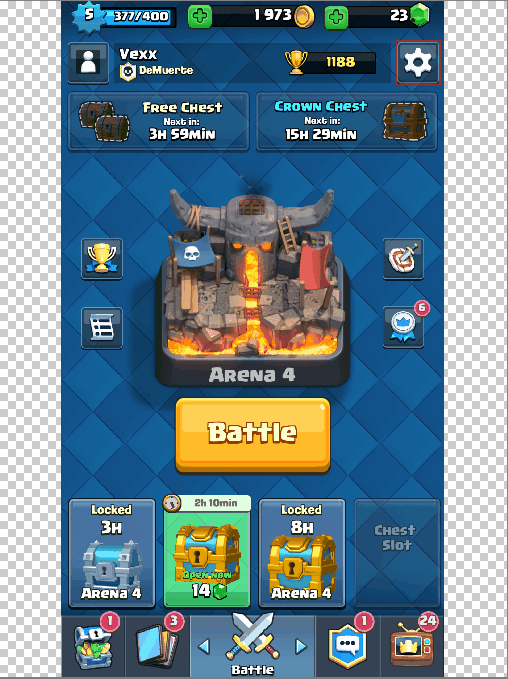
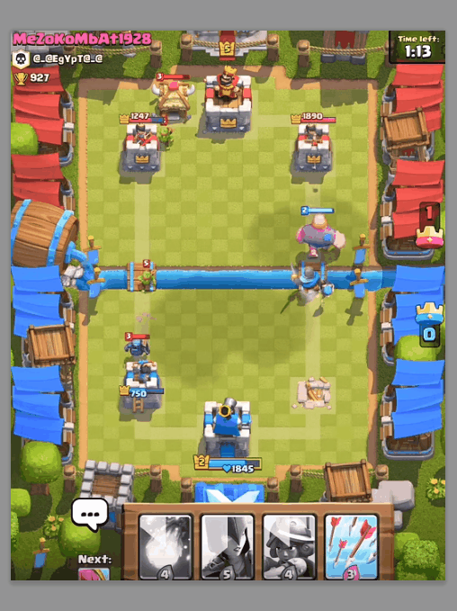

# Unity-2D-Camera 
Scale 2D Camera in Unity  

Implements inner scale in Unity3D for 2D games.  
  
Uses Unity *orthographicsize* to adjust camera for multiple resolutions. Useful for mobile games. Formula: orthographicSize = targetSize / (pixelsToUnits * 2). Detailed math explanation in keynote: https://www.youtube.com/watch?v=eIHqe8opFoU. 
  
Design the game to a "larger" scale (4:3) and then adjust the screen according to the device: from the largest to the "smallest" scale (16:9).  
  

  
The usable (interactable) part of your game (where the gameplay enrolls) will be designed to this smaller scale, so that the user has the same interaction regardless of screen size.  
  

  

